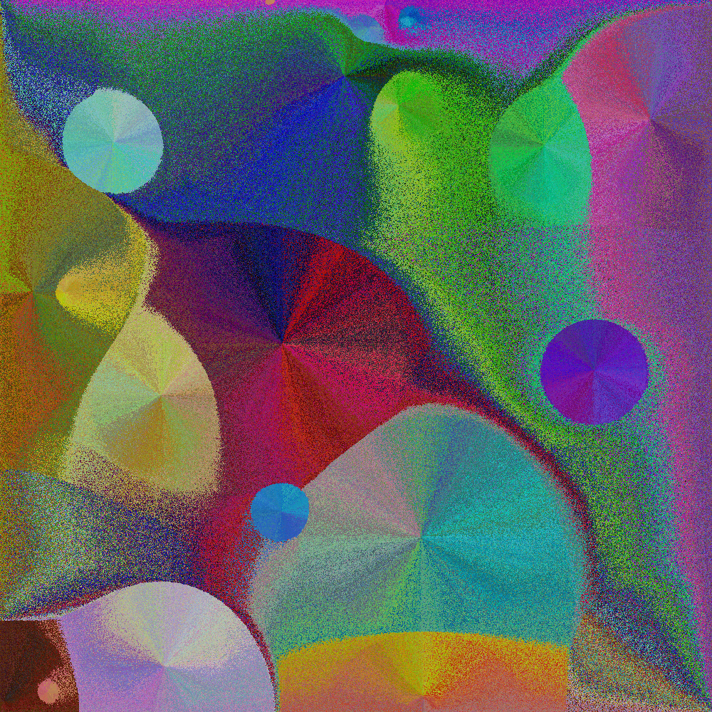

# colors
Lovely programatic images

This picture was generated in 3 minutes, 21x faster than version 0.1.0:

This was generated with `cargo run --release 10`

## How it works

First, the image is seeded with n * 2 randomly colored pixels, where n is the input.

Then, a random pixel is chosen. The pixel which has already been placed whose color is closest to that pixel is located, and the new pixel is placed as close as possible to the pixel which was located. This process is repeated until the image is filled.

The pixels are not chosen purely randomly, but are instead a random ordering over a color cube with n^2 possibilities for each of R,G,B. These pixels exactly fit into the n^3 by n^3 square canvas, which is then output.

## The algorithm

First, all possible colors are generated, and are randomly shuffled.

After the random color is picked, we search through the possible color offsets in ascending order of distance (L2 norm) to find the closest color which has already been assigned. This is pretty fast, since colors are assigned randomly.

Then, to find the location, we search through the frontier of locations which have not been assigned, but which neighbor an assigned location. This is much faster than the previous offset based approach. It's about O(n^3), where n is the input and n^6 is the number of pixels.

Overall, the algorithm is about O(n^9), and as mentioned above it takes about 3 minutes for n=10.

# Command line options

Put the size parameter as the first argument. Currently 1-15 are suppoered.

If you want debugging information, give the frequency (printout per how many pixels) that you want.
1000-10000 seems good on my machine.

The command line interface will likely be upgraded soon.
